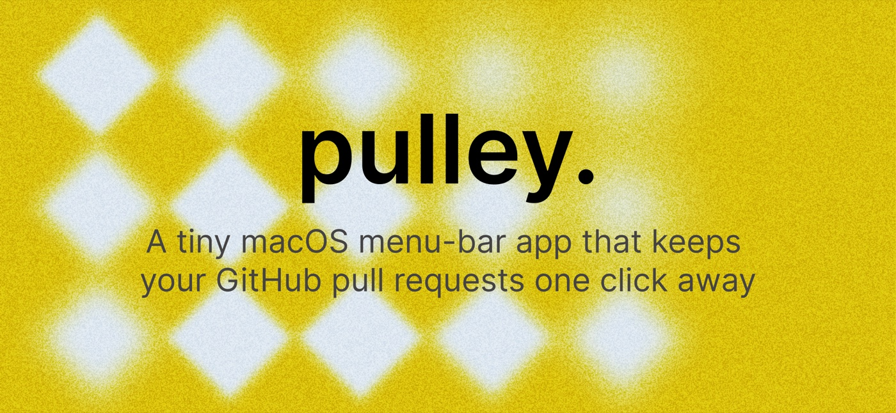
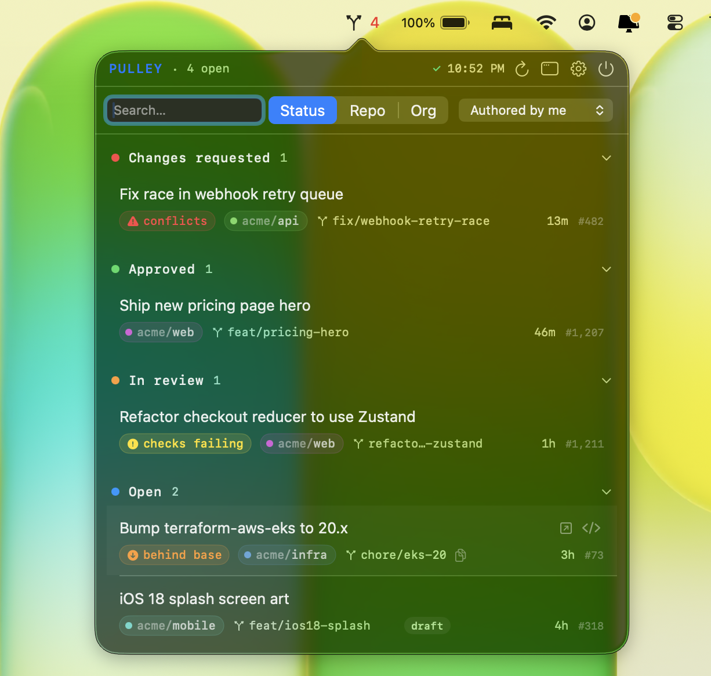
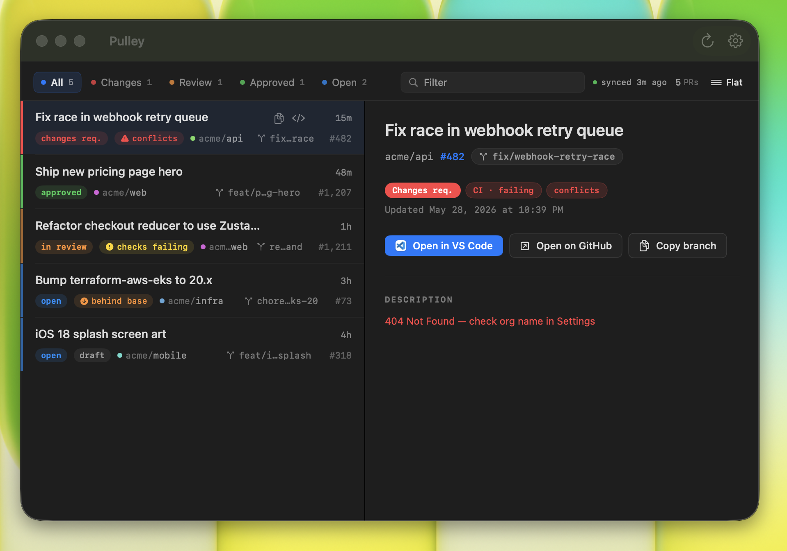

<p align="center">
  
</p>

<h1 align="center">Pulley</h1>

<p align="center">
  A tiny macOS menu-bar app that keeps your GitHub pull requests one click away —
  and checks each branch out as a git worktree so your main checkout stays clean.
</p>

<p align="center">
  <a href="https://github.com/moh-hit/pulley/releases/latest">
    
  </a>
  <a href="https://github.com/moh-hit/pulley/blob/main/LICENSE">
    
  </a>
  
</p>

---

<p align="center">
  
  &nbsp;&nbsp;
  
</p>

---

## Features

- **Live PR list** across one or many GitHub orgs, filtered by authored / review-requested / involves / assigned.
- **Grouped views** — by review status, repo, or org.
- **Open in IDE** — one click creates a sibling git worktree so your main checkout is untouched.
- **Multi-org** with per-org coloring and `org/repo` chips when repo names collide.
- **Token stored in Keychain**, never on disk.
- **Menu-bar only** — no Dock icon, no main window.

## Install

### Homebrew (recommended)

```sh
brew install moh-hit/tap/pulley
```

### Download

Grab the latest `Pulley-<version>.dmg` from the [Releases page][releases], open it, and drag `Pulley.app` to `/Applications`.

> The app is signed ad-hoc. On first launch right-click → **Open** → **Open** to clear the Gatekeeper prompt.

[releases]: https://github.com/moh-hit/pulley/releases

### Build from source

Requires Xcode 15+ / Swift 5.9, macOS 13+.

```sh
git clone https://github.com/moh-hit/pulley.git
cd pulley
./build.sh
open Pulley.app
```

## Configure

Open the popover → gear → **Settings**.

| Field | Notes |
| --- | --- |
| Personal access token | Classic PAT or a fine-grained token (see below). Stored in Keychain. |
| Organizations | One or more GitHub orgs. |
| Default scope | authored / involves / review-requested / assigned. |
| Preferred IDE | VS Code, Cursor, or Zed. |
| Workspace base dir | Where Pulley looks for clones — tries `<base>/<repo>` then `<base>/<org>/<repo>`. |
| Launch at login | Toggled via `SMAppService`. |

The token field has an **ⓘ** button with an in-app setup guide and one-click
links to GitHub's token pages (the classic link pre-checks the scopes). For
reference:

- **Classic PAT** — scopes `repo`, `read:org`, and `notifications` (the last
  enables the Inbox). Works for everything.
- **Fine-grained token** — grant access to the orgs' repositories with
  **Pull requests: Read and write**, **Contents: Read and write** (merging),
  **Checks: Read and write** (CI details + re-running individual checks),
  **Actions: Read and write** (re-running failed workflow jobs), and
  **Commit statuses: Read** (third-party CI). The Inbox isn't available on
  fine-grained tokens — GitHub has no notifications permission for them — and
  is skipped gracefully.

## Contributing

Issues and pull requests are welcome. For anything non-trivial, open an issue first.

1. Fork and create a feature branch off `main`.
2. `./build.sh` to verify the bundle launches.
3. Open a PR with a short summary of the change.

## License

[MIT](LICENSE) © Mohit Kumar
